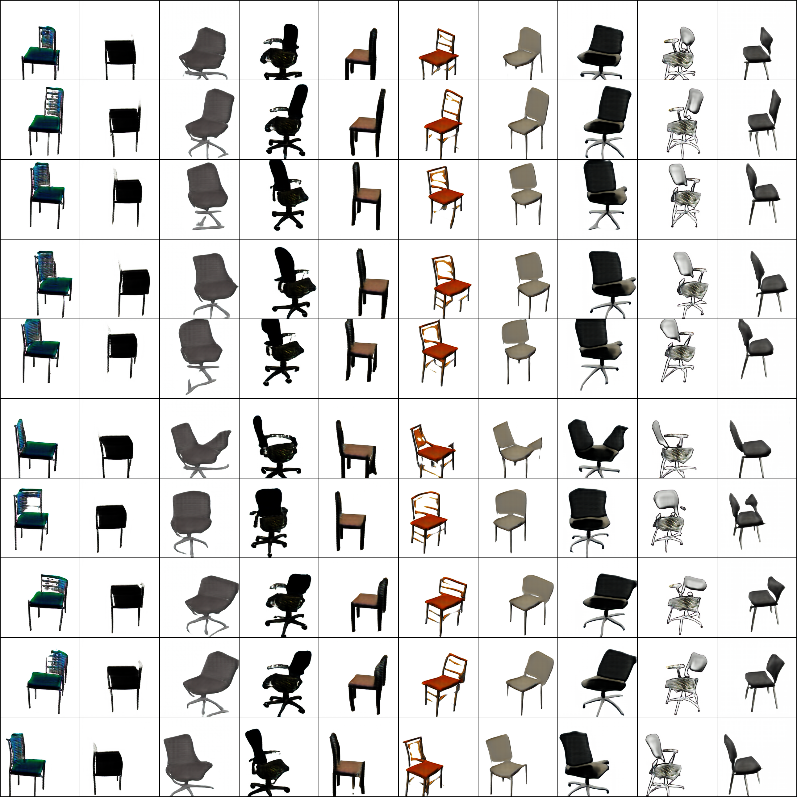

# unsupDisentanglement
Unsupervised Learning of Factorized Representation (or the effectiveness of deep learning architectures)

Learning to separate structure and texture without supervision, using an hierarchical version of InfoGAN and by leveraging priors induced by the choice of architectures and the structure of latent representations.

Broad Idea:
We use a DCGAN-based generator followed by a softmax on the spatial dimensions to generate latent features maps **z** consisting of keypoints.
We then use a ResNet with Conditional Instance Normalization to apply texture on **z** in order to generate the final image **x**. 
**x** is then fed to a DCGAN based discriminator in order to have realistic images of chairs, and to another ResNet to reconstruct **z**.

More details and experimental results will be coming.

Generated images of chairs in 256x256 resolution, with fixed structure (on a row) or with fixed texture (on a column).
Chairs on a row have the same orientation 
Not cherry picked.

Dataset: https://www.di.ens.fr/willow/research/seeing3Dchairs/
Seeing 3D chairs: exemplar part-based 2D-3D alignment using a large dataset of CAD models
M. Aubry, D. Maturana, A. Efros, B. Russell and J. Sivic
CVPR, 2014
